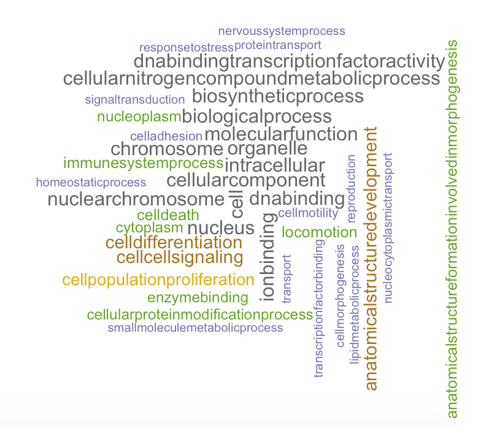

# MotifFunc

<!-- badges: start -->
<!-- badges: end -->

## Description

MotifFunc contains functions that handle genomic data to classify motifs, determine functionality, and group broad functionalities for visualization.

__Note:__ The current version only supports visualization for motif matches within Homo sapiens. Visualization looks best when previewed in RStudio.

## Installation

You can install the MotifFunc from github with:

``` r
devtools::install_github("minhanho/MotifFunc")
```

## Example Sequence of Functions
```
PWMfile <- system.file("extdata", "MA0007.1.transfac", package = "MotifFunc")
match_names <- classifyPcmMotifs(PWMfile)
functionFreq <- getFunctionWC(match_names)
```
Or

```
match_names <- classifySeqMotifs("AGCGTAGGCGT")
functionFreq <- getFunctionWC(match_names)
```

## Example Output



## One Minute Pitch Slide


