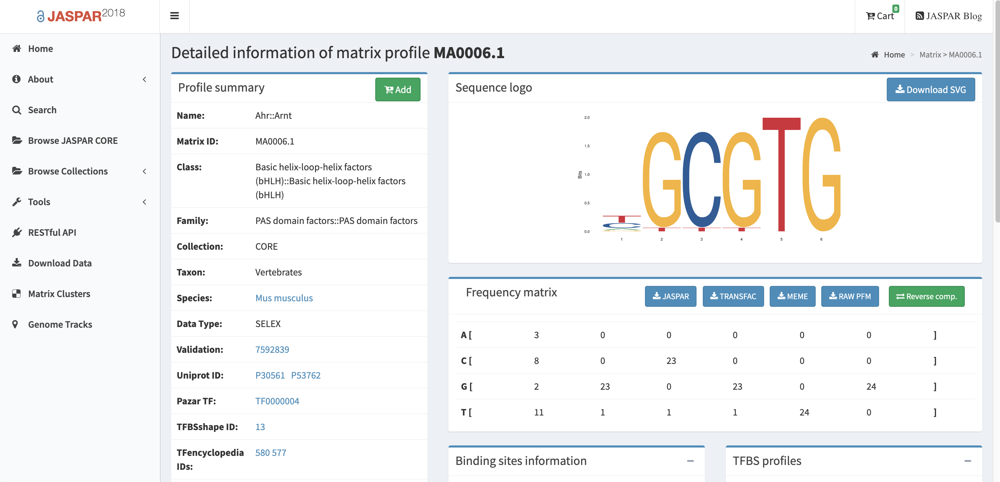
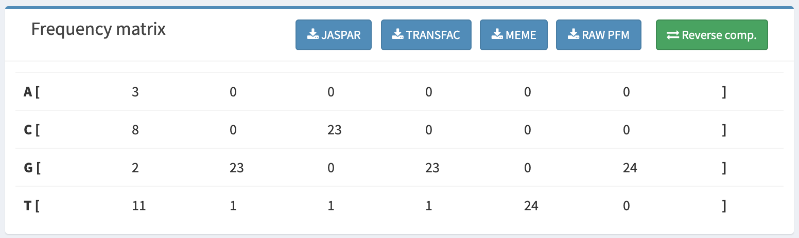
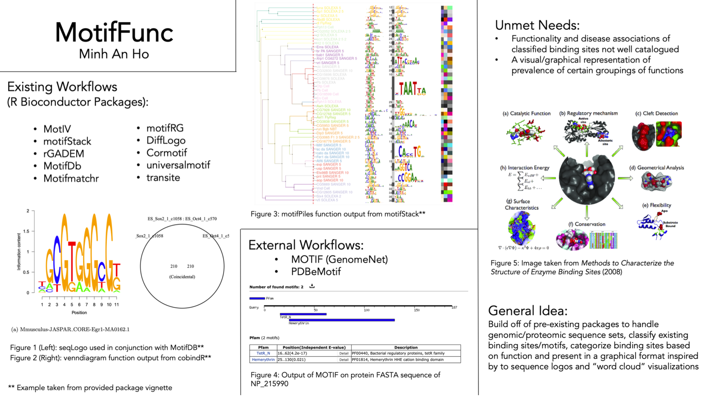

# MotifFunc

<!-- badges: start -->
<!-- badges: end -->

## Description

MotifFunc contains functions that handle genomic data to classify motifs, determine functionality, and group broad functionalities for word cloud visualization. As with the word cloud format, functions with the same frequency are displayed in the same colour and size.

__Note:__ The current version only supports visualization for motif matches within Homo sapiens. Visualization looks best when previewed in RStudio.

## Installation

You can install the MotifFunc from github with:

``` r
devtools::install_github("minhanho/MotifFunc")
```

## Example Sequence of Functions
```
PWMfile <- system.file("extdata", "MA0007.1.transfac", package = "MotifFunc")
match_names <- classifyPcmMotifs(PWMfile)
functionFreq <- getFunctionWC(match_names)
```
Or

```
match_names <- classifySeqMotifs("AGCGTAGGCGT")
functionFreq <- getFunctionWC(match_names)
```

## Example Output


## Retreiving an Input Data Set
When using `classifySeqMotifs()`, the input is a string composed of your choice of nucleotides (i.e. "A", "C", "G", "T")

But when using `classifyPcmMotifs()`, you must specify a path on your computer to a transfac or txt file containing frequency matrix data, to do this:
* Navigate to http://jaspar.genereg.net/
* Select a profile
* Download the "Frequency Matrix" in TRANSFAC format




## One Minute Pitch Slide


